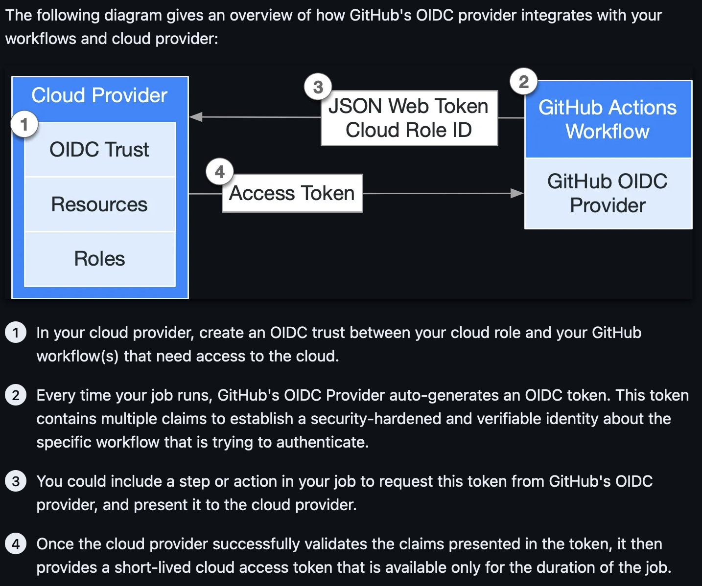
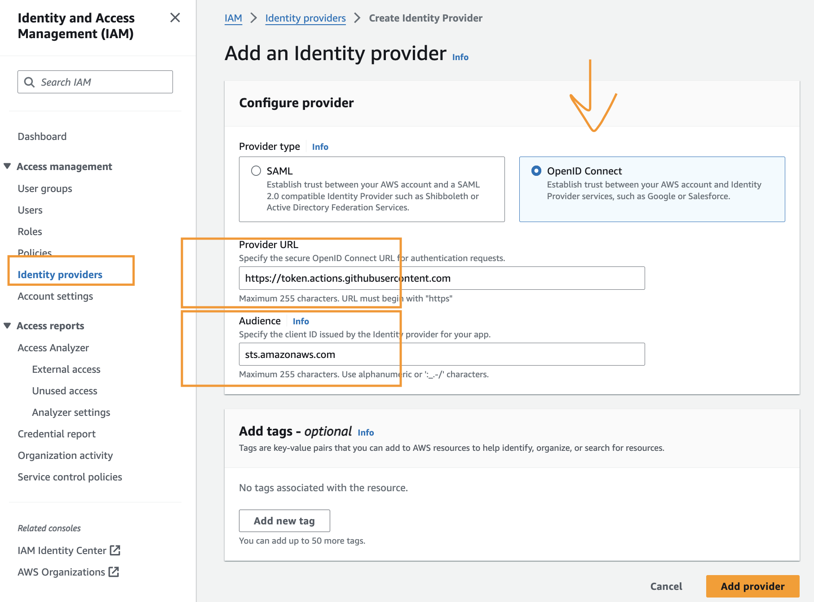
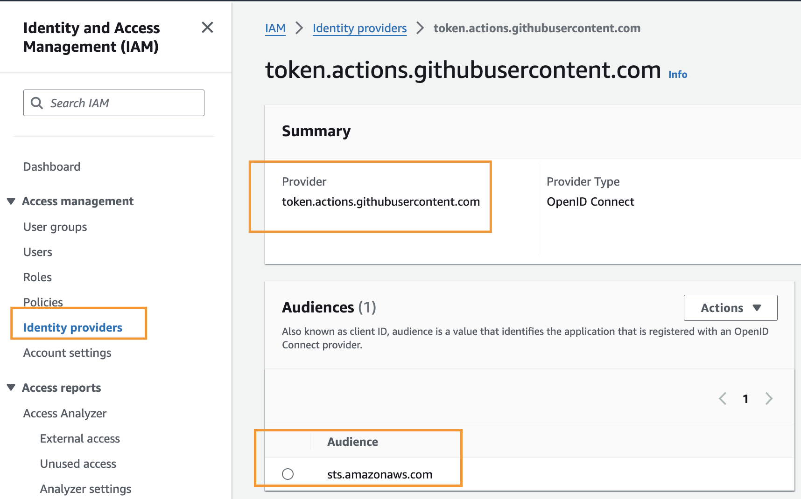
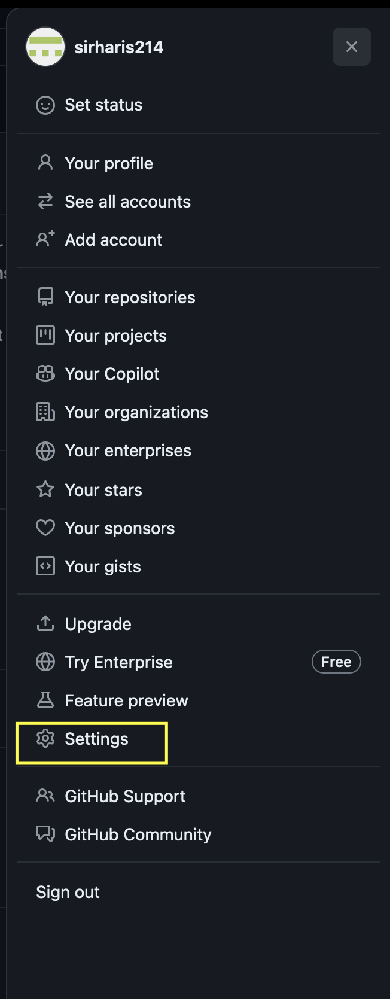
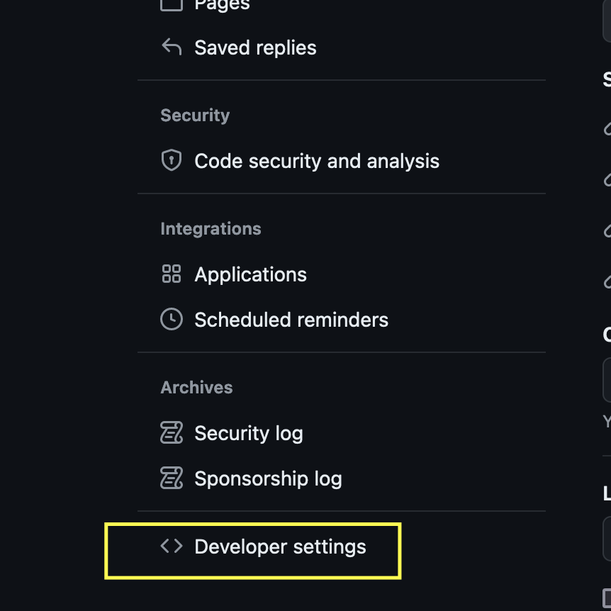
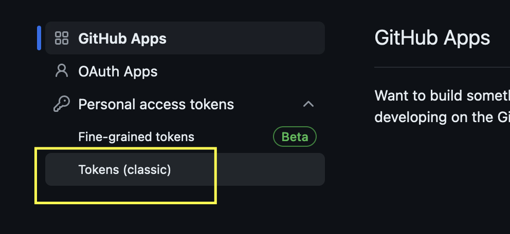
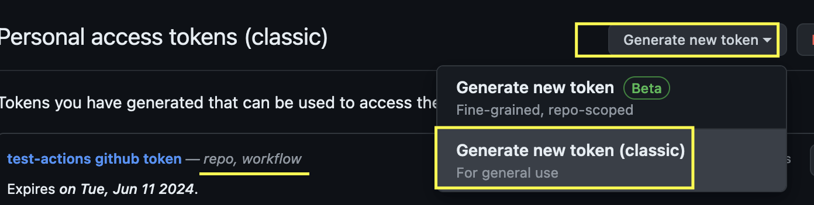
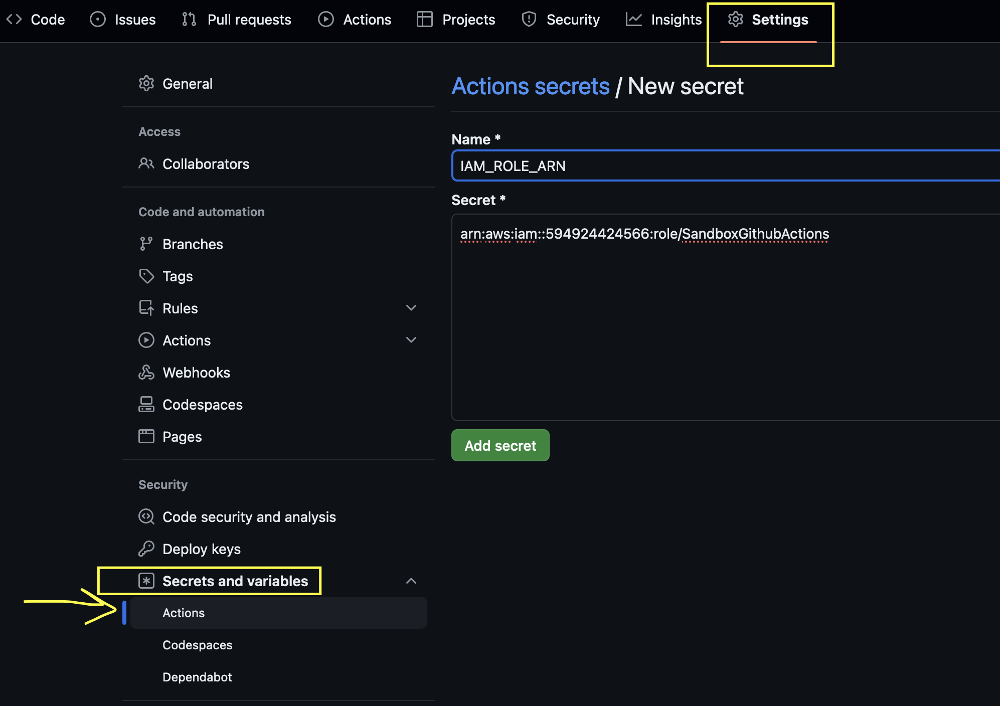

# Overview



[Reference](https://docs.github.com/en/actions/deployment/security-hardening-your-deployments/about-security-hardening-with-openid-connect#getting-started-with-oidc)

The above link is to GitHub's OIDC documentation, which provides a comprehensive overview of the workflow of GitHub Actions and OIDC authentication. 

To summarize in layman terms:

1. **Authentication in GitHub Actions Workflow:**
    - During the initial steps of a GitHub Actions workflow, the job must authenticate into your AWS account.
    - We are using OIDC (OpenID Connect) for authentication.
    - In this method, AWS provides the GitHub Actions job with a temporary access token to access the AWS account and perform actions based on the configured permissions.

2. **Creating Trust in AWS:**
    - To allow GitHub Actions to authenticate, you need to create a trust relationship between your AWS account and the GitHub OIDC provider.
    - You then create a IAM Role with the trust policy to have condition block verifing the repo name and other parameters 
        - parameters vary based on the github action workflow trigger e.g., push event, pull request event, github enviornment used or not etc.
    - AWS IAM validates the request by checking the metadata sent by the GitHub Actions OIDC to determine whether to grant the access token.
    - Example: The requester's repository name must be `xxx` and the branch name must be `yyy`.

3. **Creating GitHub Actions Workflow:**
    - You will create a GitHub Actions workflow that authenticates into the AWS account using OIDC by providing the role created in the previous step.
    - After the job completes, the access token expires regardless of the job's status (failed or successful).

## Details steps on No.2 Creating Trust in AWS
### Step 1: Configuring the Identity Provider in AWS

1. Go to the AWS Management Console and navigate to the IAM page.
2. Select **Access Management > Identity Providers**.
3. Click **Add Provider** and choose **OpenID Connect (OIDC)**.
4. Fill in the following details:
    - **Provider URL**: `https://token.actions.githubusercontent.com`
    - **Audience**: `sts.amazonaws.com`
5. Click **Add Provider**.





### Step 2: Creating the IAM Role for GitHub Actions

The OIDC access token request will include the IAM Role to assume. This role will have criteria that the OIDC must match in order to be assumed.
This can be configured via the Console or Infrastructure as Code (IaC).

1. Go to the AWS Management Console and navigate to the IAM page.
2. Select **Access Management > Roles**.
3. Click **Create Role**.
4. Choose **Custom Trust Policy** and paste the following example policy:
5. Create a permission set/permission policy for the IAM role and remember to follow the principle of least privilege.

Example custom trust policy (Step 2.4) for a github action workflow triggered on a Pull Request merge from *feature* branch -> *dev* branch
```json
{
    "Version": "2012-10-17",
    "Statement": [
        {
            "Sid": "SandboxGithubActionsAssumeRole",
            "Effect": "Allow",
            "Principal": {
                "Federated": "arn:aws:iam::<AWS_ACCOUNT_ID>:oidc-provider/token.actions.githubusercontent.com"
            },
            "Action": "sts:AssumeRoleWithWebIdentity",
            "Condition": {
                "StringLike": {
                    "token.actions.githubusercontent.com:aud": "sts.amazonaws.com",
                    "token.actions.githubusercontent.com:sub": [
                        "repo:<GITHUB_USERNAME>/<REPO_NAME>:pull_request",
                        "repo:<GITHUB_USERNAME>/<REPO_NAME>:ref:refs/heads/dev"
                    ]
                }
            }
        }
    ]
}
```

## Details steps on No.3 Creating GitHub Actions Workflow

Content of deploy.yaml under dir `./github/workflows/deploy.yaml`. Rather than storing hard coded values in the workflow file, you can create github action secrets that can be referenced within the workflow file. In our case the repo is private and we need to create a github token for github actions to be able to checkout the repo during the job run. 

1. Create a GITHUB Token for github actions to be able to clone the repo during the job run.
2. Add a Github Actions Secret in the repo's settings and make the value the Token from the step above
    - We secret name can't start with `GITHUB_` so we named it `TOKEN_GITHUB`
    - you can also add the IAM Role ARN to secrets.
3. Create the workflow file. 

### Step 1. Create GITHUB Token 
After you create the Token, store it somewhere safe to reference in the next step










### Step 2. Store Github Action Secrets

you reference these secrets in your workflow yaml file like so: `${{ secrets.IAM_ROLE_ARN }}`



### Step 3. Create the workflow
This will trigger a github actions workflow when a pull request closes to merge to dev branch. An if statement has been used to confirm the merge occured to the dev branch.

```yaml
name: Deploy Terraform

on:
  pull_request:
    branches:
      - dev
    types:
      - closed

permissions:
  id-token: write
  contents: read
jobs:
  plan:
    runs-on: ubuntu-latest
    if: github.event.pull_request.merged && github.event.pull_request.base.ref == 'dev' 
    env:
      TF_WORKSPACE: dev
      TF_IN_AUTOMATION: 'true'
      TF_INPUT: 'false'
      AWS_REGION : "us-east-1"
    steps:
    - name: Checkout code
      uses: actions/checkout@v4
      with:
        token: ${{ secrets.TOKEN_GITHUB }}
    - name: Configure AWS credentials
      uses: aws-actions/configure-aws-credentials@v4
      with:
        role-to-assume: ${{ secrets.IAM_ROLE_ARN }}
        aws-region: ${{ env.AWS_REGION }}
        role-duration-seconds: 900
        audience: sts.amazonaws.com
    - name: Install Terraform
      uses: hashicorp/setup-terraform@v3
      with:
        terraform_version: "1.5.6"
    - name: Initialize Terraform
      id: init
      working-directory: ./build/dev/
      run: terraform init
    - name: Terraform Plan
      id: plan
      working-directory: ./build/dev/
      run: terraform plan -no-color -out=plan.out
    - name: Summary
      if: always()
      id: summary
      run: |
        echo -e ${{ toJson(steps.plan.outputs.stdout) }} 
```
